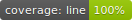
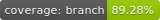

# Triangle Evaluator

Given three positive values `A`, `B`, `C`, which are interpreted as representing the length of the sides of a triangle, `TriangleEvaluator` will return 
 a string that states whether the triangle is scalene, isosceles, equilateral, right angled, or not a valid triangle. 
